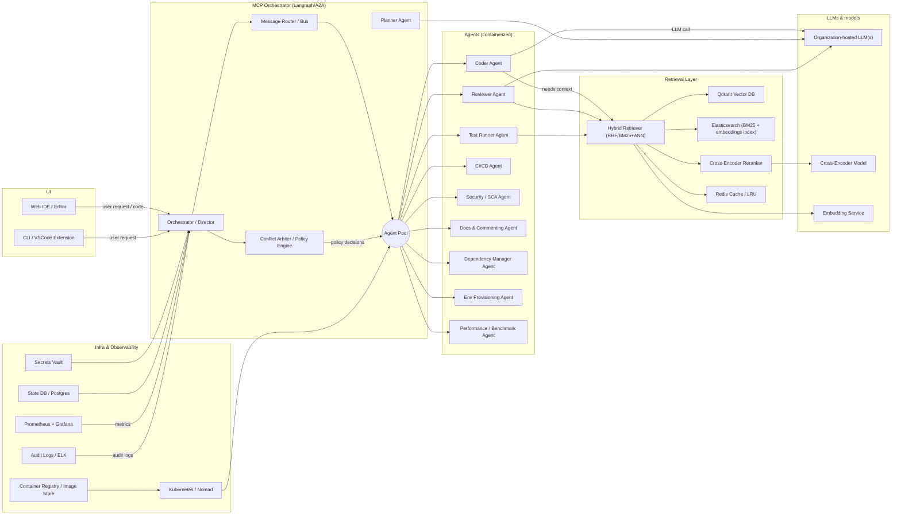

```mermaid
flowchart LR
  subgraph UI
    WebIDE["Web IDE / Editor"]
    CLI["CLI / VSCode Extension"]
  end
  subgraph MCP_Server["MCP Orchestrator (Langraph/A2A)"]
    Orchestrator["Orchestrator / Director"]
    Planner["Planner Agent"]
    Router["Message Router / Bus"]
    AgentPool(("Agent Pool"))
    Arbiter["Conflict Arbiter / Policy Engine"]
  end
  subgraph Agents["Agents (containerized)"]
    Coder["Coder Agent"]
    Reviewer["Reviewer Agent"]
    Tester["Test Runner Agent"]
    CI["CI/CD Agent"]
    Sec["Security / SCA Agent"]
    Doc["Docs & Commenting Agent"]
    Dep["Dependency Manager Agent"]
    Env["Env Provisioning Agent"]
    Bench["Performance / Benchmark Agent"]
  end
  subgraph Retrieval["Retrieval Layer"]
    Qdrant["Qdrant Vector DB"]
    ES["Elasticsearch (BM25 + embeddings index)"]
    Retriever["Hybrid Retriever (RRF/BM25+ANN)"]
    Reranker["Cross-Encoder Reranker"]
    Cache["Redis Cache / LRU"]
  end
  subgraph LLMs["LLMs & models"]
    OrgLLM["Organization-hosted LLM(s)"]
    CrossEncoder["Cross-Encoder Model"]
    EmbeddingSvc["Embedding Service"]
  end
  subgraph Infra["Infra & Observability"]
    Registry["Container Registry / Image Store"]
    K8s["Kubernetes / Nomad"]
    Vault["Secrets Vault"]
    DBops["State DB / Postgres"]
    Prom["Prometheus + Grafana"]
    Audit["Audit Logs / ELK"]
  end
  WebIDE -->|user request / code| Orchestrator
  CLI -->|user request| Orchestrator
  Orchestrator --> Router
  Router --> AgentPool
  AgentPool --> Coder
  AgentPool --> Reviewer
  AgentPool --> Tester
  AgentPool --> CI
  AgentPool --> Sec
  AgentPool --> Doc
  AgentPool --> Dep
  AgentPool --> Env
  AgentPool --> Bench
  Coder -->|needs context| Retriever
  Reviewer --> Retriever
  Tester --> Retriever
  Retriever --> Qdrant
  Retriever --> ES
  Retriever --> Cache
  Retriever --> EmbeddingSvc
  Retriever --> Reranker
  Reranker --> CrossEncoder
  Coder -->|LLM call| OrgLLM
  Planner --> OrgLLM
  Reviewer --> OrgLLM
  Orchestrator --> Arbiter
  Arbiter -->|policy decisions| AgentPool
  K8s --> AgentPool
  Registry --> K8s
  Vault --> Orchestrator
  DBops --> Orchestrator
  Prom -->|metrics| Orchestrator
  Audit -->|audit logs| Orchestrator
```
